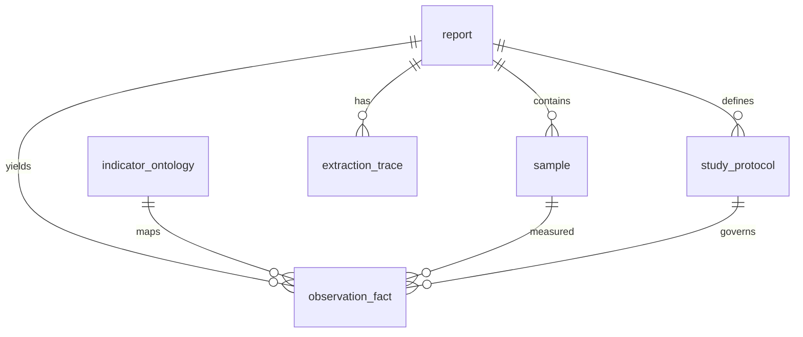
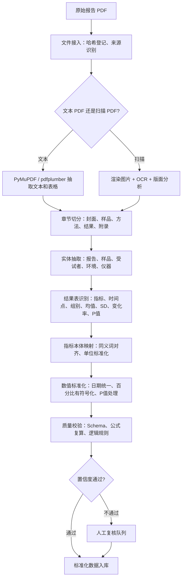

# 化妆品检测报告数据标准化蓝图

## 概述

本蓝图源自 [liangchao-cosmetic-standardization](https://github.com/ztzzh/liangchao-cosmetic-standardization) 项目的方法论，旨在建立一套可持续迭代的化妆品功效检测报告标准化方案，覆盖多机构、多版式、非结构化报告的结构化抽取与统一建模。

---

## 1. 数据模型

采用"证据优先"的长表建模思路，将每一份报告拆解为以下实体：

### 实体关系

### 实体定义

| 实体 | 角色 | 关键字段 |
|---|---|---|
| **report** | 报告级元数据 | report_id, report_no, issue_date, testing_agency, source_file_hash |
| **sample** | 样品/委托方/批次 | sample_name, batch_no, specification, applicant_name |
| **study_protocol** | 测试方案 | study_objective, claim_effects, reference_method, subject_cohort, instrument, environment |
| **indicator_ontology** | 指标本体 | code, canonical_name, aliases, unit, effect_direction |
| **observation_fact** | 观测事实（长表） | report_id, sample_id, indicator_code, timepoint, group_name, value_mean, value_sd, change_rate_pct, p_value, improvement_flag |
| **extraction_trace** | 证据追溯 | fact_id, source_page, source_bbox, source_text, extraction_confidence |

### 长表建模优势

- 一行代表"某报告、某样品、某指标、某时间点、某组别"的一次观测
- 天然支持多机构、多指标、多时间点、多组别
- 每个值可追溯到原始页码和区域
- 需要宽表时通过 pivot 生成

---

## 2. 指标本体

指标本体是标准化方案的核心资产。不同机构对同一指标的表达不同，需要建立同义词映射和改善方向知识。

### 标准指标词表

| 标准码 | 标准名称 | 机构常见别名 | 单位 | 改善方向 |
|---|---|---|---|---|
| `skin_moisture_content` | 皮肤角质层水分含量 | 皮肤水分含量、水分含量、皮肤含水量、Corneometer Unit | 仪器指数 (CU) | higher_is_better |
| `tewl` | 经表皮水分流失 TEWL | 皮肤经表皮水分流失TEWL值、经皮失水率TEWL、TEWL、transepidermal water loss | g/(h·m²) 或仪器指数 | lower_is_better |
| `skin_firmness_r0` | 面部紧致度 R0 | 面部紧致度R0、紧致度、R0 | 仪器指数 | lower_is_better |
| `skin_elasticity_r2` | 面部皮肤弹性 R2 | 面部皮肤弹性R2、皮肤弹性、R2 | 仪器指数 | higher_is_better |
| `skin_color_ita` | 皮肤颜色 ITA° | ITA、ITA°、皮肤颜色ITA | 度 (°) | higher_is_better |

### 映射策略（优先级降序）

1. **强特征锁定**：`TEWL`、`ITA`、`R0`、`R2` 等英文缩写或专有名词优先匹配
2. **全称别名匹配**：匹配标准名称和已知别名表
3. **模糊匹配**：编辑距离/序列匹配做容错
4. **人工确认**：低于置信度阈值或高风险指标走人工审核

---

## 3. 标准化工作流

### 整体流程

### 关键步骤说明

#### 3.1 文件接入与分流

- 计算文件 SHA-256，避免重复处理
- 按 `agency/year/batch/` 分区存储
- 判断 PDF 是否有文本层：有则走文本抽取，无则走 OCR

#### 3.2 章节切分

利用目录关键词（"样品信息"、"测试结果"、"统计分析"、"附录"等）将报告分割为独立模块，降低单模块抽取复杂度。

#### 3.3 结果表识别

文本型 PDF 用 pdfplumber/Camelot 提取表格；扫描件用版面检测定位表格区域后做 OCR。解析后做**表头语义校验**——必须能识别出指标名、时间点、均值/SD、变化率、P 值等核心列。

#### 3.4 指标本体映射

参考第 2 节策略，优先使用强特征词锁定指标，避免"皮肤经表皮水分流失TEWL值"被误归为"皮肤水分含量"。

#### 3.5 数值标准化

| 原始表达 | 标准化规则 | 示例 |
|---|---|---|
| 使用样品 14 天后、D14、14天 | → `timepoint_code: D14` | 统一编码 |
| 30.37%、-10.44% | → 有符号浮点数 `30.37`, `-10.44` | 统一符号 |
| 16.73±4.87 | → 拆分为 `mean=16.73`, `sd=4.87` | 均值/标准差拆分 |
| p<0.001、0.000 | → 保留原文，标准化为 `<0.001` | 不丢失精度 |
| ***、显著、有显著性差异 | → 枚举化 | 统一显著性级别 |

---

## 4. 质量保障

### 4.1 字段级准确率

| 字段类型 | 目标准确率 | 验收方式 |
|---|---|---|
| 报告编号、日期、机构名 | ≥ 98% | 精确匹配 |
| 样品名、委托方 | ≥ 95% | 字段级 F1 |
| 指标名称映射 | ≥ 95% (高风险指标人工复核) | Top-1 准确率 |
| 数值字段 | 绝对误差 ≤ 0.01 | 数值对比 |
| 表格行完整性 | ≥ 95% | 行召回率 |

### 4.2 公式级校验

- `change_rate_pct ≈ (post_value - baseline_value) / baseline_value × 100`
- `p_value < 0.05` 应对应显著性标记
- `improvement_flag` 根据 `effect_direction` 计算，不直接相信文字描述

### 4.3 证据级追溯

每个关键字段保存：
- 页码、表格/段落类型、bbox 坐标
- 原始文本、抽取工具版本、置信度

业务方质疑某个值时，可直接打开对应页和框选区域复核。

### 4.4 批量监控指标

- 每批报告字段缺失率
- 各机构模板漂移率（结果表行召回率异常下降时告警）
- OCR 平均置信度
- 指标未映射率
- 人工复核通过率

---

## 5. 工程落地建议

### 技术栈

| 模块 | 推荐 | 原因 |
|---|---|---|
| 语言 | Python | PDF/OCR/数据处理生态完整 |
| 文本 PDF 抽取 | PyMuPDF, pdfplumber | 页级文本 + 表格坐标 |
| 扫描件 OCR | PaddleOCR / docTR | 中文 OCR + 版面分析 |
| 表格识别 | pdfplumber（文本）/ OCR 表格重建（扫描） | 两类 PDF 分流处理 |
| 字段抽取 | 规则模板 + 小模型/LLM | 封面走规则，复杂段落走模型 |
| 数据校验 | Pydantic / Great Expectations | Schema + 数值范围 + 公式 |
| 存储 | 对象存储（原始文件）+ PostgreSQL（结构化结果） | 兼顾追溯和查询 |
| 任务编排 | Prefect / Airflow | 批量异步处理 |
| 人工复核 | Streamlit 页面 | 显示原图、bbox、抽取值 |

### 扩展路径

| 阶段 | 方式 |
|---|---|
| 百份量级 | 半自动抽取 + 人工复核，规则为主 |
| 千份量级 | 引入 OCR + 模板版本化 + 指标本体迭代 |
| 万份量级 | 任务队列 + 文本/扫描 PDF 分流 + 自动 QA + 监控告警 |

---

## 6. 参考来源

- [liangchao-cosmetic-standardization](https://github.com/ztzzh/liangchao-cosmetic-standardization) — 量潮科技数据工程师笔试题方案与原型
- 国家药监局《化妆品功效宣称评价规范》 — 合规口径参考
- SGS、CTI 华测、PONY 谱尼 公开功效检测报告 — 版式模式分析样本
